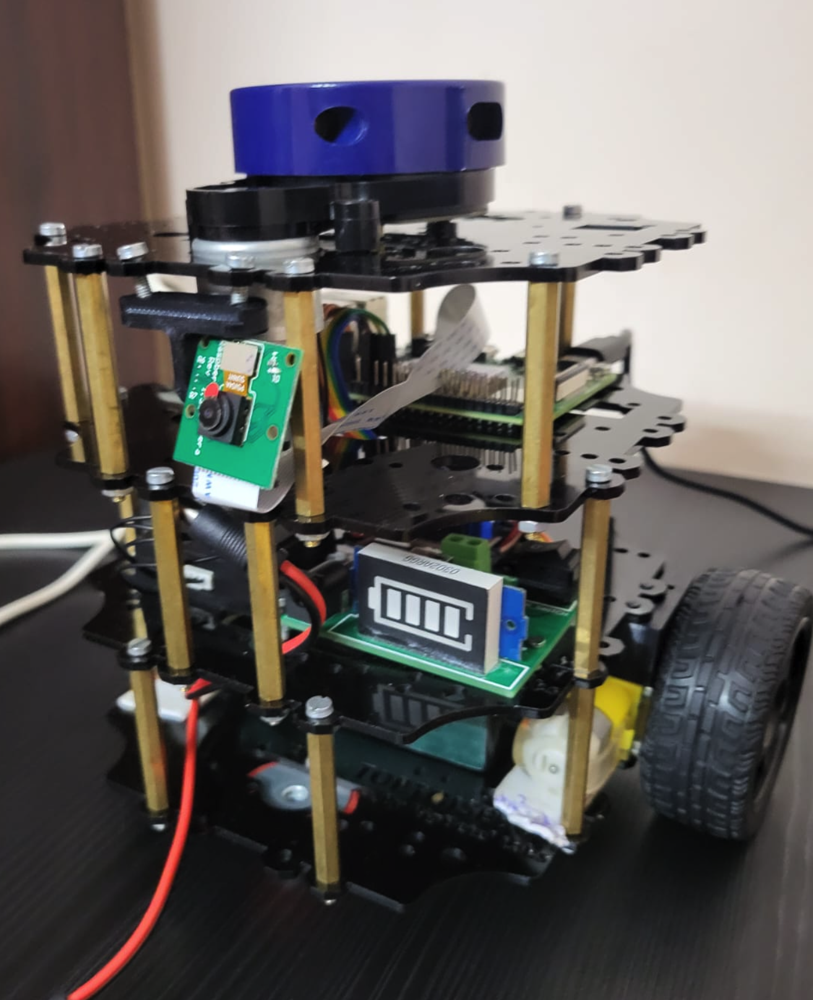
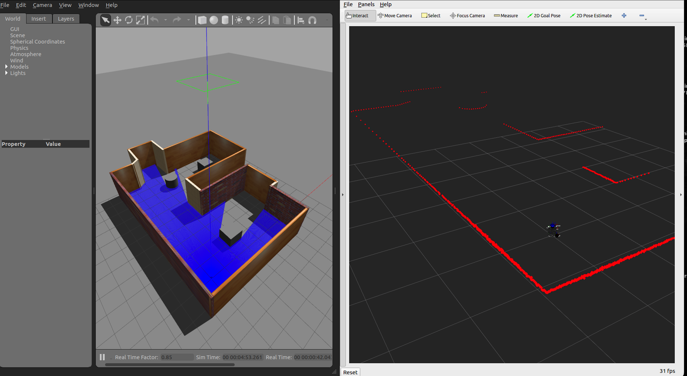
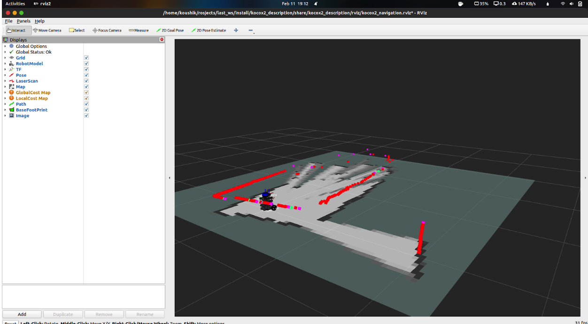
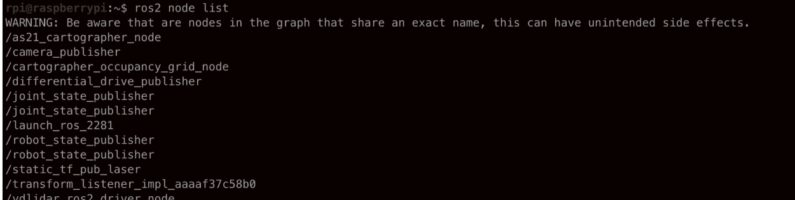
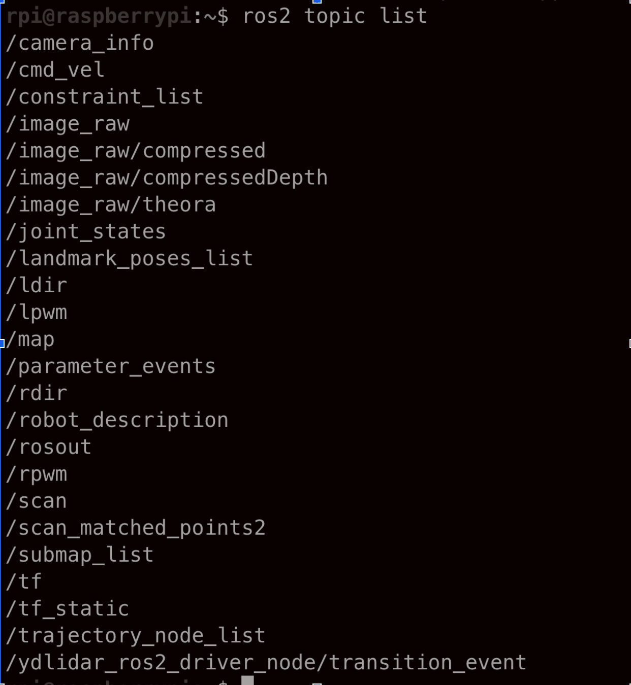

# KocoX2 Robot

[](https://docs.ros.org/en/humble/)
[](https://releases.ubuntu.com/22.04/)



A 2-wheeled differential drive robot featuring the YDLidar X2 for autonomous navigation and SLAM capabilities. This is a Learning project.

> **Note**: This is an open-loop control system. The robot's movement relies on direct motor commands without encoder feedback, which may result in reduced accuracy compared to closed-loop systems. Future versions may implement closed-loop control using encoders for improved precision. 


## Features

- Differential drive system
- YDLidar X2 for 2D mapping
- ROS2 Humble support
- Navigation2 stack integration
- Cartographer SLAM
- Gazebo simulation
- Teleoperation support
- Autonomous navigation

## Hardware Requirements

### Robot Components
- Raspberry Pi 4 
- YDLidar X2
- 2 DC motors 
- Motor driver board
- Power supply (12V)

### Development Computer
- Ubuntu 22.04 LTS
- 4GB RAM minimum
- USB ports for sensors

## Software Installation

### 1. ROS2 Humble Setup
```bash
# Follow ROS2 Humble installation instructions from:
# https://docs.ros.org/en/humble/Installation/Ubuntu-Install.html
```

### 2. Workspace Creation
```bash
source /opt/ros/humble/setup.bash  
mkdir -p ~/kocox2_ws/src
cd ~/kocox2_ws/
colcon build
source ~/kocox2_ws/install/setup.bash
```

### 3. Dependencies Installation
```bash
sudo apt install \
  ros-humble-joint-state-publisher \
  ros-humble-robot-state-publisher \
  ros-humble-cartographer \
  ros-humble-cartographer-ros \
  ros-humble-gazebo-plugins \
  ros-humble-teleop-twist-keyboard \
  ros-humble-teleop-twist-joy \
  ros-humble-xacro \
  ros-humble-nav2* \
  ros-humble-urdf
```

### 4. KocoX2 Repository Setup
```bash
cd ~/kocox2_ws/src
git clone https://github.com/Kou-shik2004/KocoX2
cd ~/kocox2_ws/
colcon build
source /opt/ros/humble/setup.bash
source ~/kocox2_ws/install/setup.bash
```

## YDLidar X2 Setup

### 1. SDK Installation
```bash
# Install dependencies
sudo apt install cmake pkg-config swig python3-pip

# Build YDLidar SDK
cd YDLidar-SDK/build
cmake ..
make
sudo make install

# Install Python package
cd YDLidar-SDK
pip install .
```

### 2. LiDAR Testing
```bash
# Set USB permissions
sudo chmod 777 /dev/ttyUSB0

# Run test program
cd ~/YDLidar-SDK/build
./tri_test
```

Note: Keep both YDLidar SDK and YDLidar ROS2 driver outside the src directory.

## Usage Instructions

### Simulation Environment



1. Launch Simulation
```bash
ros2 launch kocox2_bringup bringup.launch.py use_sim_time:=True
```

2. Teleoperation
```bash
ros2 run teleop_twist_keyboard teleop_twist_keyboard
```

3. SLAM Navigation
```bash
ros2 launch kocox2_bringup autobringup.launch.py use_sim_time:=True exploration:=True
```

### Real Robot Operation

#### Robot Network Setup
1. Configure WiFi in `/etc/netplan/50-cloud-init.yaml`:
```yaml
wifis:
  wlan0:
    optional: true
    access-points:
      "your_ssid_name":
        password: "your_password"
    dhcp4: true
```

2. Connect to Robot
```bash
ssh <rpi_username>@raspberrypi.local
```

#### SLAM and Navigation




1. Start Mapping
```bash
ros2 launch kocox2_bringup autobringup.launch.py use_sim_time:=False exploration:=True
```

2. Save Map
```bash
ros2 run nav2_map_server map_saver_cli -f /path_to_map/name_of_map_file.yaml
```

3. Navigate with Existing Map
```bash
ros2 launch kocox2_bringup autobringup.launch.py use_sim_time:=False exploration:=False map:=/path_to_map/map_file_name.yaml
```




### Development PC Setup

1. Clone Repository
```bash
cd ~/kocox2_ws/src
git clone https://github.com/Kou-shik2004/KocoX2
```

2. Configure ROS Domain
```bash
echo "export ROS_DOMAIN_ID=<unique_number>" >> ~/.bashrc
source ~/.bashrc
```

3. Launch Visualization
```bash
ros2 launch kocox2_description rviz.launch.py
```

## Package Structure

- **kocox2_bringup**: Launch files and robot initialization
- **kocox2_description**: Robot URDF and visual models
- **kocox2_navigation**: Navigation parameters and configuration
- **kocox2_slam**: SLAM configuration

## Configuration

### Navigation Parameters
Located in `config/nav2_params.yaml`:
- DWB planner parameters
- Costmap configurations
- AMCL parameters

### SLAM Parameters
Located in `config/slam.lua`:
- Cartographer configurations
- Loop closure settings
- Map resolution

## Troubleshooting

1. **USB Connection Issues**
   - Check USB permissions
   - Verify correct port assignment
   - Test with `tri_test` program

2. **Navigation Problems**
   - Verify TF tree completeness
   - Check sensor data publication
   - Validate costmap updates

3. **Network Issues**
   - Confirm ROS_DOMAIN_ID settings
   - Check network connectivity
   - Verify hostname resolution

## Important Tips

- Always source ROS2 and workspace in new terminals
- Place robot at original mapping position when using saved maps
- Use `use_sim_time:=False` for real robot operation
- Backup navigation parameters before modification
- Regular calibration improves performance
  
  


