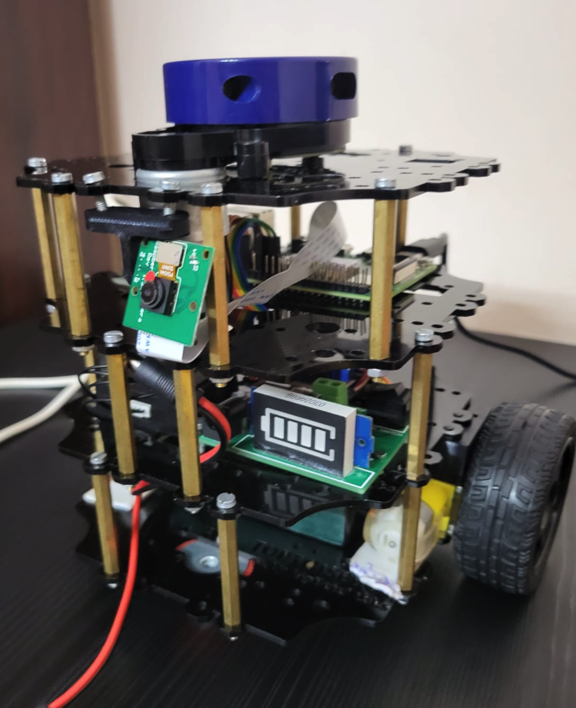
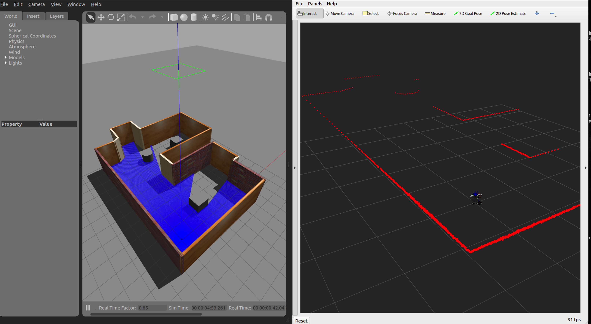
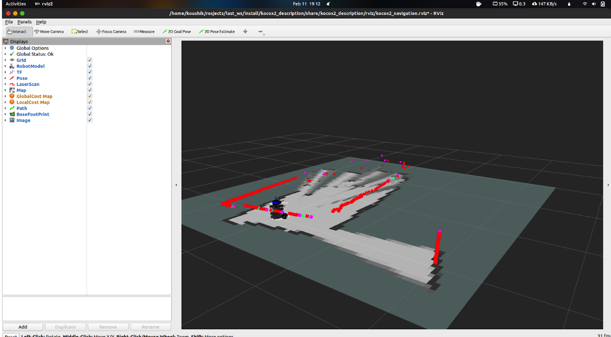

# KocoX2

A 2-wheel differential-drive robot on a Raspberry Pi, running Cartographer SLAM and Nav2
navigation with a YDLidar X2. Built as a learning project.

https://github.com/user-attachments/assets/7e7bd0c5-28c3-4c3f-9b76-30aeba73fdc7



The robot runs Cartographer for SLAM and Nav2 (NavFn planner, DWB controller) for navigation,
with a YDLidar X2 for scanning, a USB camera, and a Raspberry Pi GPIO node driving two DC motors
through an H-bridge. The work here is hardware integration: wiring the lidar and camera drivers,
writing the motor driver, getting TF and the sensor frames right, and tuning the costmaps and
SLAM config for this base.

## Requirements

- Ubuntu 22.04, ROS 2 Humble, Gazebo Classic
- Raspberry Pi 4 (real robot), YDLidar X2, USB camera, 2 DC motors with a driver board, 12V
  supply

```bash
sudo apt install \
  ros-humble-joint-state-publisher \
  ros-humble-robot-state-publisher \
  ros-humble-cartographer \
  ros-humble-cartographer-ros \
  ros-humble-gazebo-plugins \
  ros-humble-teleop-twist-keyboard \
  ros-humble-xacro \
  ros-humble-nav2* \
  ros-humble-urdf \
  ros-humble-v4l2-camera \
  ros-humble-rviz2 \
  python3-rpi.gpio
```

## Running it

### Workspace setup

```bash
source /opt/ros/humble/setup.bash
mkdir -p ~/kocox2_ws/src
cd ~/kocox2_ws/src
git clone https://github.com/Kou-shik2004/KocoX2
cd ~/kocox2_ws
colcon build
source install/setup.bash
```

The YDLidar SDK and ROS 2 driver are vendored inside this repo (`YDLidar-SDK/`,
`ydlidar_ros2_driver/`) and build as part of the workspace above. To also build and install the
SDK standalone for `tri_test` and other SDK tools:

```bash
sudo apt install cmake pkg-config swig python3-pip
cd ~/kocox2_ws/src/KocoX2/YDLidar-SDK/build
cmake ..
make
sudo make install
cd ~/kocox2_ws/src/KocoX2/YDLidar-SDK
pip install .
```

Set USB permissions and test the lidar directly:

```bash
sudo chmod 777 /dev/ttyUSB0
cd ~/kocox2_ws/src/KocoX2/YDLidar-SDK/build
./tri_test
```

### Simulation



```bash
ros2 launch kocox2_bringup bringup.launch.py use_sim_time:=True
ros2 run teleop_twist_keyboard teleop_twist_keyboard
```

Map and navigate in sim:

```bash
ros2 launch kocox2_bringup autobringup.launch.py use_sim_time:=True exploration:=True
```

### Real robot

Set the robot's Wi-Fi in `/etc/netplan/50-cloud-init.yaml`, then connect over SSH:

```bash
ssh <rpi_username>@raspberrypi.local
```

Map:

```bash
ros2 launch kocox2_bringup autobringup.launch.py use_sim_time:=False exploration:=True
```

Save the map. `map_saver_cli -f` takes a base filename, not a `.yaml` path; it writes
`<name>.pgm` and `<name>.yaml` next to it:

```bash
ros2 run nav2_map_server map_saver_cli -f /path_to_map/my_map
```

Navigate with a saved map:

```bash
ros2 launch kocox2_bringup autobringup.launch.py use_sim_time:=False exploration:=False map:=/path_to_map/my_map.yaml
```



### Visualization from a development PC

```bash
echo "export ROS_DOMAIN_ID=<unique_number>" >> ~/.bashrc
source ~/.bashrc
ros2 launch kocox2_bringup rviz.launch.py
```

## How it works

Four packages:

| Package | Contents |
|---|---|
| `kocox2_bringup` | All launch files, plus the saved maps (`maps/`) |
| `kocox2_description` | URDF/xacro, meshes, Gazebo plugin config, the simulation world, RViz configs |
| `kocox2_navigation` | Nav2 params (`nav2_params_robot.yaml`, `nav2_params_simulation.yaml`) and the Cartographer config (`slam.lua`) |
| `kocox2_firmware` | `differential.py`, the only node this repo runs on its own hardware |

`differential.py` subscribes to `cmd_vel` and drives the motors over `RPi.GPIO`: it converts
linear and angular velocity into left/right wheel speeds, maps them to PWM duty cycle, and sets
the H-bridge direction pins. It has no encoder input and publishes no odometry.

Sensing and localization are Cartographer (2D SLAM, laser scan matching, no odometry input) and
Nav2's AMCL for localizing against a saved map. Navigation is Nav2's NavFn global planner and DWB
local controller, using the standard costmap layers built from the YDLidar scan.

## Known limitations

- **No wheel feedback.** No encoders, no `/odom`, no closed-loop velocity control.
- **Wheel separation disagrees across three files**: the URDF joint origins give 0.141 m, the
  Gazebo diff-drive plugin uses 0.172 m, and the firmware node uses 0.17 m. Worth measuring
  against the physical robot and reconciling.
- **`nav2_params_robot.yaml` and `nav2_params_simulation.yaml` differ by only two values**
  (`max_vel_x`, `acc_lim_theta`). The rest of the tuning is shared between sim and the real robot.
- **Some Nav2 parameter names predate Humble** (`recoveries_server` / `nav2_recoveries/*`,
  `default_bt_xml_filename`). Humble renamed these; on Humble, that section of config is ignored
  and the affected servers fall back to their defaults.
- **`kocox2_navigation/config/ekf.yaml`** is not launched by anything in this repo. There's no
  `/imu` topic and no `/odom` topic for it to fuse.
- Commands in this README weren't rebuilt or re-run while preparing this documentation.
